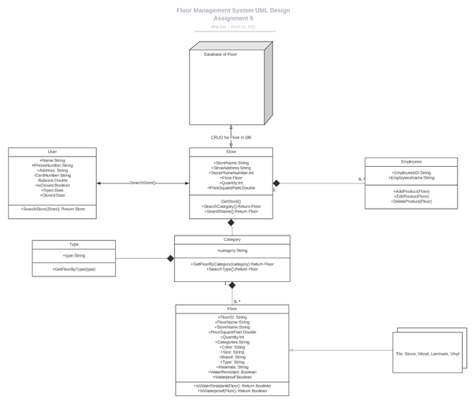
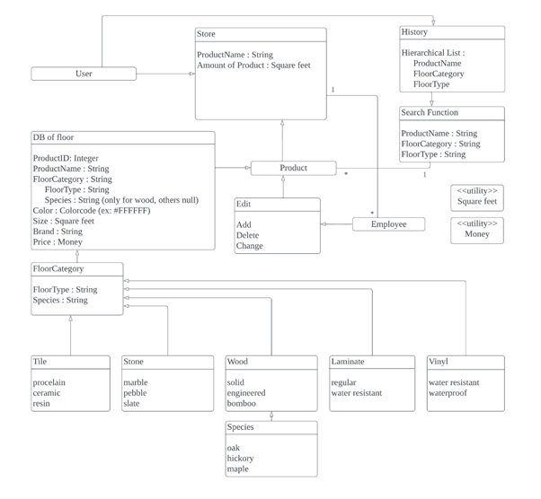
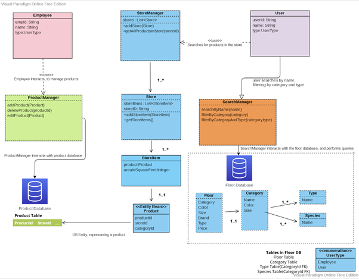
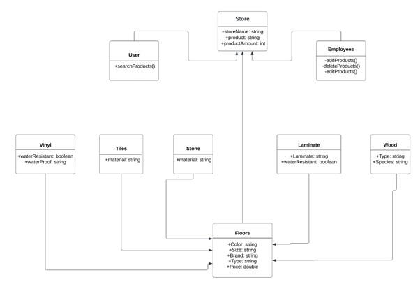
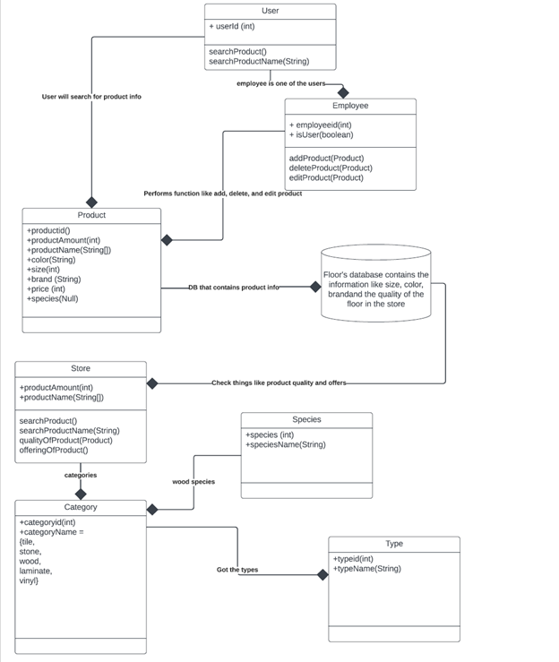
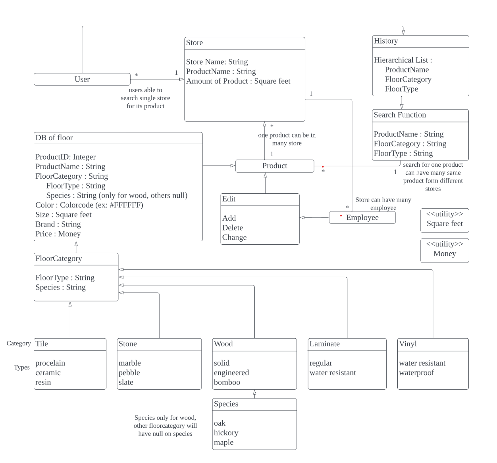

## Design 1 BingGao

	Pros
        Has declared functions and types in all different class
	Cons
        Attributes that are not in the requirements
        Did not complete requirement 5 for users to use the hierarchical list

## Design 2 JiawenLin

	Pros
        The design is very detailed and explained well, especially the FloorCategory.	
	Cons
		Relationship explanation is not clear enough

## Design 3 KamalGurung

    Pros:
        It clearly visualizes the design pattern that includes user, store manager and employee.
        It clearly shows that the user requirement can be fulfilled as per the requirements such as color, size, brand, type and price.
        It has mentioned that employee can add, edit and remove the items from the product Database.
        It tells that store manager can also get the items information from the product database. 
    Cons:
        Only one database (DB of floor) is required.
        It has not implemented the specific items like tile, stone, wood, laminate and vinyl.
        It has added extra items i.e. product manger and store manager.
        Did not complete requirement 5 for users to use the hierarchical list

## Design 4 somezzedup

    Pros: 
        Design is simple and easy to follow to show the relationship between each classes. 
    Cons: 
        Dependencies are not specified in the line.
        UML does not implement a database
        Did not complete requirement 5 for users to use the hierarchical list

## Design 5 Muhammadzair

    Pros
        Clear relationships from different class
        
    Cons: 
        User sure be able to look into different store directly
        Requirement 5 is not complete
        Employee should be an employee of the single store but a user can be in different stores

## Team Design:

    We have picked design 2 and added more relationship definition
    Add Store name to represent different stores
    We agree with that floor category and other attributes to be saved in DB that can be searched by searching function

## Summary

    As we discussed the design pattern from group 3, we finalized the design pattern that fulfills most of the requirements.
