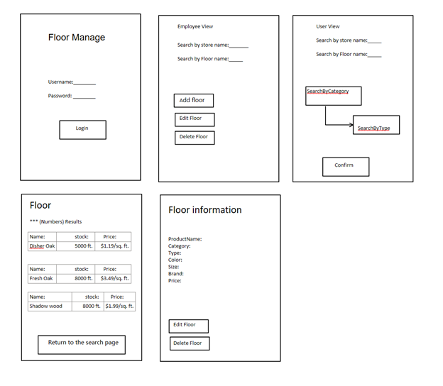

# Design Document

**Author**: \<person or team name\>

## 1 Design Considerations

### 1.1 Assumptions

Assumption :Bugs may occur.
Dependency: Should only work on Android Device.
Significant issue that may arise - Software compatibility across different Android versions or Phones.

### 1.2 Constraints

The lists will be stored locally, so if the user deletes the app, the user might lose the list data. Employees will gain access to additional features in comparison to non-employee users.

### 1.3 System Environment

Android smartphones are well suited to handle an app. The minimum API level for the app should be Level 21. Use SQlite as our primary database.

## 2 Architectural Design

### 2.1 Component Diagram

When  the user opens the app, the home screen is displayed. There are two options: guest user (no login required) and employee login. Employees can modify inventory such as insert and delete as well as search but guest users can only search. Employees and users can search from different types of flooring materials. The user whether guest user or employee can then exit the app.

### 2.2 Deployment Diagram

*This section should describe how the different components will be deployed on actual hardware devices. Similar to the previous subsection, this diagram may be unnecessary for simple systems; in these cases, simply state so and concisely state why.*

## 3 Low-Level Design

*Describe the low-level design for each of the system components identified in the previous section. For each component, you should provide details in the following UML diagrams to show its internal structure.*

### 3.1 Class Diagram

*In the case of an OO design, the internal structure of a software component would typically be expressed as a UML class diagram that represents the static class structure for the component and their relationships.*

### 3.2 Other Diagrams

*Describe some dynamic aspects of your system using one or more behavioral diagrams, such as sequence and state diagrams.*

## 4 User Interface Design
*For GUI-based systems, this section should provide the specific format/layout of the user interface of the system (e.g., in the form of graphical mockups).*

